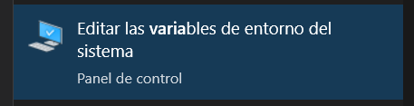
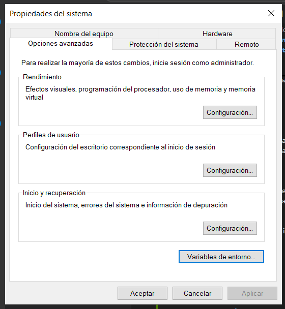
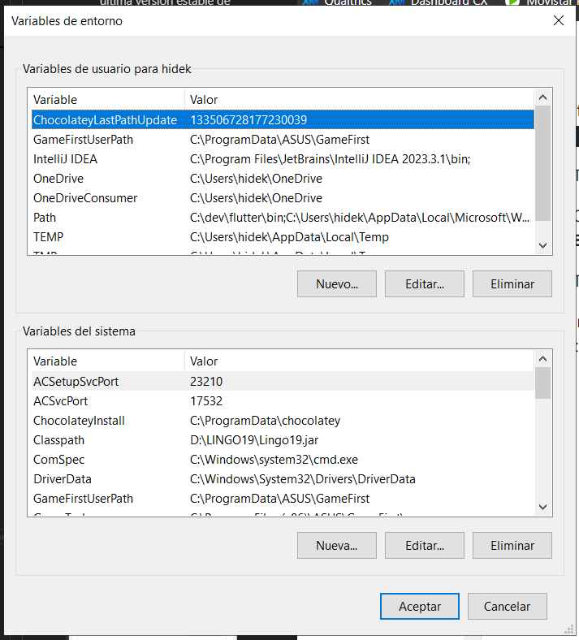
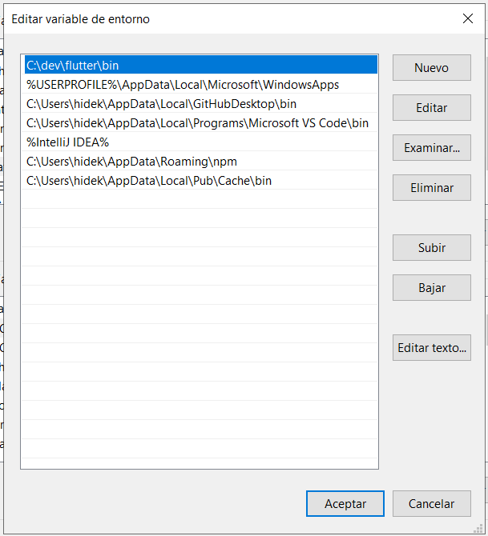
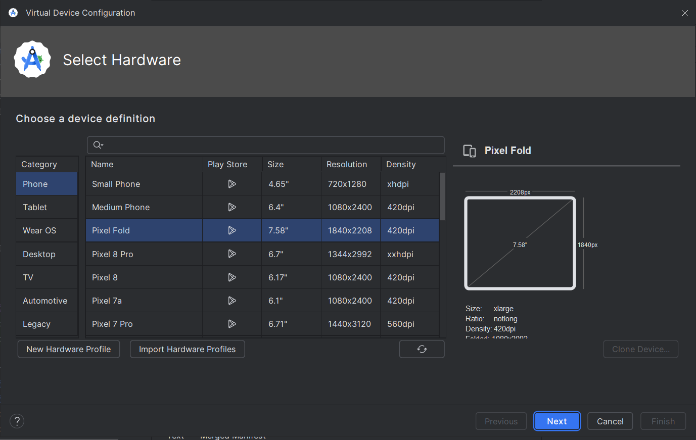

# Desarrollo de la aplicación para gestionar eventos "qSale"

## Integrantes
    - Hideki Sotero
    - Kohji Onaja
    - Walter Campos
    - Luis Martinez
    - Alvaro Sanchez

## Índice
- [Aspectos técnicos del software](#aspectos-técnicos-del-software)
    - [Entorno de desarrollo](#entorno-de-desarrollo)
    - [Diagrama de despliegue](#diagrama-de-despliegue)
    - [Requerimientos no funcionales](#requerimientos-no-funcionales)
    - [Diagrama de casos de uso](#diagrama-de-casos-de-uso)
    - [Requerimientos funcionales](#requerimientos-funcionales)
    - [Descripción de casos de uso](#descripción-de-casos-de-uso)


## Aspectos técnicos del software


### Entorno de desarrollo

El entorno de desarrollo que se utilizará para la aplicación de qSale será Flutter. Se tiene planeado usar el framework multiplataforma para poder desplegar la aplicación en móviles tanto en Android como iOS. Se utilizará todo lo que ofrece el lenguaje dart y las librerías de google para ofrecer al público una aplicación moderna y sencilla de usar. Gracias a la libreria de material3 se pueden mostrar componentes llamativos e intuitivos de usar. De este modo "qSale" será capaz de ofrecer una experiencia de usuario de alto nivel para crear, compartir y asistir a eventos de la comunidad.

<p align="center">
  
</p>

<p align="center">
  
</p>


Para iniciar con el desarrollo de la aplicacion primero fue necesario realizar el proceso de instalación de flutter framework.

#### **Verificación de los requerimeintos del sistema**

Flutter puede ser instalado y ejecutado tanto en windows como como macOS. En este caso nos centraremos en el uso del sistema operativo Windows. Para ello se recomiendan los siguientes requerimeintos en terminos de hardware.

| Requisito                       | Mínimo          | Recomendado      |
|----------------------------------|-----------------|------------------|
| Núcleos de CPU x86_64            | 4               | 8                |
| Memoria en GB                    | 8               | 16               |
| Resolución de pantalla en píxeles | WXGA (1366 x 768) | FHD (1920 x 1080) |
| Espacio libre en disco en GB     | 11.0            | 60.0             |

En términos de software se requiere que el sistema operativo de windows este actualizado ya sea windows 10 u 11. Estas dos versiones del sistema operativo soportan Flutter. Es necesario quw el sistema incluya Windows PowerShell 5 o superior.

#### **Herramientas de desarrollo**

Son dos las herramientas necesarias para poder realizar la compilación de código flutter correctamente

- La primera de ellas de Git, el servicio en la nube de control de versiones será necesario para guardar diferentes versiones del proyecto y poder desarrollar el código de forma colaborativa.

- La segunda y necesaria es Andorid Studio. Dado que se compilará en la aplicación en un dispositivo android, es necesario este entorno para moder crear dispositivos virtuales en los cuales se probarán las diferentes funciones del software. Asimismo, el entorno de desarrollo permite configurar las diferentes herramientas necesarias para el desarrollo y la instalación de SDK de andorid

- La tercera y opcional es xCode. Este editor de código permiote compilar el codigo de flutter en un dispositivo iOS. Del mismo modo que Android Studio se podrán configurar diferentes dispositivos con el sistema operativo de Apple y configurar diferentes herramientas de desarrollo.

#### **Configuración del editor de código o IDE**

Se pueden utilizar tres editores de código para el desarrollo de codigo en el framework de flutter en el lenguaje dart.
- VSCode
- Andorid Studio
- IntelliJ IDEA

#### **Intalación del SDK de Flutter**

En la misma web de desarrolladores de Flutter se encuentra disponible la versión más actual de flutter para su instalación en windows.

https://docs.flutter.dev/get-started/install/windows/mobile

1. Se debe descagar la última versión estable de flutter la cual viene en un archivo de tipo zip

2. Como segundo paso, se debe crear un directorio en el cual se va a realizar la instalación de flutter. Se recomienda crear un directorio de nombre "dev" en el disco principal.

3. Extraer el zip en el directorio creado para la instalación.

#### Actualización de la variable de entorno de windows

1. En el buscador de windows buscar: Variables de entorno.



2. Se abrira la siguiente ventana y se debe seleccionar la opción "Variables de entorno"



3. Emergerá una venta con las variables de entorno existentes en el dispositivo. Se debe seleccionar la opcion de "path" y seleccionar la opción "editar".



4. Dentro de la nueva ventana se debe colocar "nuevo" y colocar la ruta del directorio en el que se encuentra instalado flutter.



5. Finalmente para aplicar los cambios es necesario cerrar y abrir todas las terminales abiertas.

#### Configurar ambiente de Android

Es necesario instalas los siguientes componentes de Andorid que normalmente se instalan junto con Andorid Studio.

- Android SDK Platform, API 35.0.1
- Android SDK Command-line Tools
- Android SDK Build-Tools
- Android SDK Platform-Tools
- Android Emulator

De no estar activado algun componente se puede hacer desde la configuración de Android Studio.

#### Configurar Dispositivo Android

Para realizar la configuración de un dispositivo virtual es necesario crear un emulador desde Andorid Studio.



Se puede seleccionar el dispositivo de preferencia y la versión de Android a la que va dirigida la aplicación.

#### Aceptar las licencias de Android

Es necesario aceptar las licencias de andorid para poder compilar correctamente y que el entono de flutter funcione correctamiente.

Para ello se debe ejecutar el siguiente comando en la terminal.

```
C:> flutter doctor --android-licenses
```

Una vez ejecutado el comando se puede utilizar el comando flutter doctor para verificar que todo este instalado correctamente.

```
PS C:> flutter doctor
```

Si se siguieron todos los pasos solo debería faltar la instalaciuón de Visual Studio que no es necesario para el desarrollo de aplicaciones en FLutter.

### Diagrama de despliegue

### Requerimientos no funcionales

### Diagrama de casos de uso

### Requerimientos funcionales

### Descripción de casos de uso
