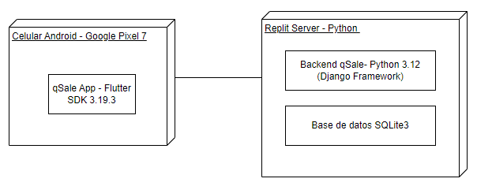

# Desarrollo de la aplicación para gestionar eventos "qSale"

## Integrantes
    - Hideki Sotero
    - Kohji Onaja
    - Walter Campos
    - Luis Martinez
    - Alvaro Sanchez

## Índice
- [Aspectos técnicos del software](#aspectos-técnicos-del-software)
    - [Entorno de desarrollo](#entorno-de-desarrollo)
    - [Diagrama de despliegue](#diagrama-de-despliegue)
    - [Requerimientos no funcionales](#requerimientos-no-funcionales)
    - [Diagrama de casos de uso](#diagrama-de-casos-de-uso)
    - [Requerimientos funcionales](#requerimientos-funcionales)
    - [Descripción de casos de uso](#descripción-de-casos-de-uso)

## Aspectos técnicos del software

### Entorno de desarrollo

El entorno de desarrollo que se utilizará para la aplicación de qSale será Flutter. Se tiene planeado usar el framework multiplataforma para poder desplegar la aplicación en móviles tanto en Android como iOS. Se utilizará todo lo que ofrece el lenguaje dart y las librerías de google para ofrecer al público una aplicación moderna y sencilla de usar. Gracias a la libreria de material3 se pueden mostrar componentes llamativos e intuitivos de usar. De este modo "qSale" será capaz de ofrecer una experiencia de usuario de alto nivel para crear, compartir y asistir a eventos de la comunidad.

   

Para iniciar con el desarrollo de la aplicacion primero fue necesario realizar el proceso de instalación de flutter framework.

### Diagrama de despliegue

El diagrama de despliegue representa la disposición física de los componentes del sistema mostrando como estos interactúan entre sí en una cierta infraestructura. 

Para el desarollo de nuestro proyecto utilizaremos un celular simulado modelo Google Pixel 7 , el cual va a ejecutar nuestra app qSale desarrollada en FlutterSDK v3.19.3. Nuestro Backend y Base de datos se van a encontrar soportados en Replit. El backend qSale estará desarrollado en Python v3.12 usando el framework Django y la base de datos será una base de datos SQLite3.

### Requerimientos no funcionales

### Diagrama de casos de uso

### Requerimientos funcionales

### Descripción de casos de uso
